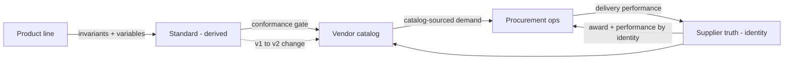
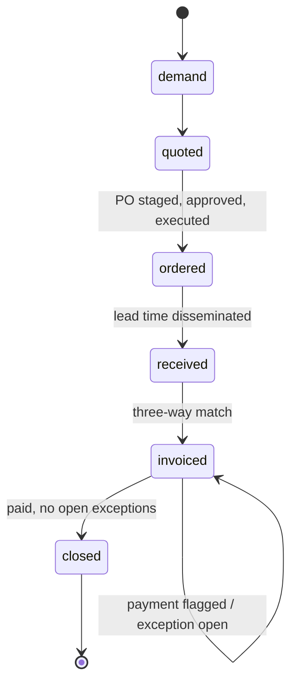
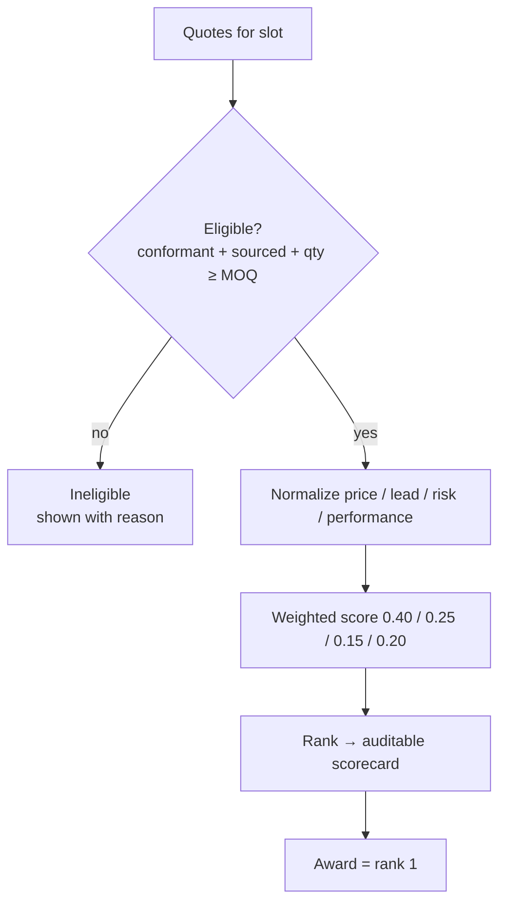

# Diagrams

## Pipeline

```mermaid
flowchart LR
  PL[Product line] -->|invariants + variables| STD[Standard - derived]
  STD -->|conformance gate| CAT[Vendor catalog]
  SUP[Supplier truth - identity] --> CAT
  CAT -->|catalog-sourced demand| OPS[Procurement ops]
  SUP -->|award + performance by identity| OPS
  OPS -->|delivery performance| SUP
  STD -.->|v1 to v2 change| CAT
```

## Lifecycle

```mermaid
stateDiagram-v2
  [*] --> demand
  demand --> quoted
  quoted --> ordered: PO staged, approved, executed
  ordered --> received: lead time disseminated
  received --> invoiced: three-way match
  invoiced --> closed: paid, no open exceptions
  invoiced --> invoiced: payment flagged / exception open
  closed --> [*]
```

## Award decision

```mermaid
flowchart TD
  Q[Quotes for slot] --> G{Eligible?<br/>conformant + sourced + qty ≥ MOQ}
  G -->|no| X[Ineligible<br/>shown with reason]
  G -->|yes| N[Normalize price / lead / risk / performance]
  N --> W[Weighted score 0.40 / 0.25 / 0.15 / 0.20]
  W --> R[Rank → auditable scorecard]
  R --> A[Award = rank 1]
```