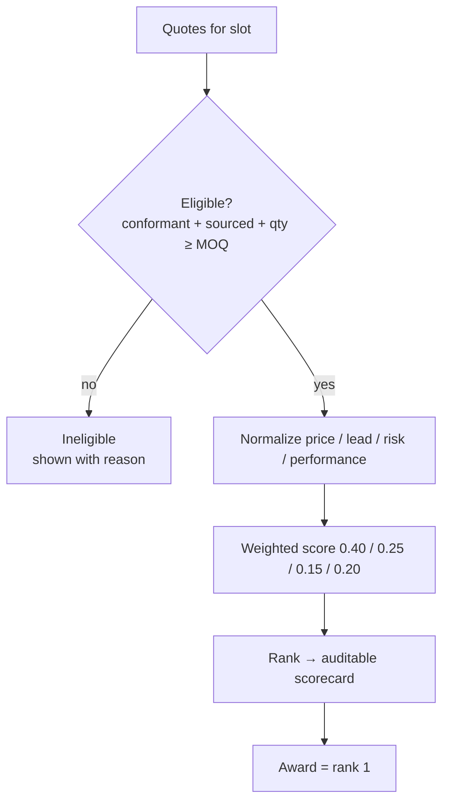

# Award scorecards (v1)

**motor** (order 120; weights: price 0.4 · lead 0.25 · risk 0.15 · performance 0.2)

| rank | entry | supplier | price | lead | risk | perf | score | outcome |
| --- | --- | --- | --- | --- | --- | --- | --- | --- |
| 1 | m-soylent-54 | Soylent Drives LLC | $37.00 | 14d | 1.00 | 0.80 | 0.95 | 🏆 AWARD |
| 2 | m-acme-12 | Acme Steel Inc | $39.50 | 21d | 0.67 | 0.90 | 0.67 | eligible |
| 3 | m-acme-24 | Acme Steel Inc | $42.00 | 21d | 0.67 | 0.90 | 0.47 | eligible |
| 4 | m-globex-24 | Globex Plastics LLC | $40.00 | 35d | 0.00 | 0.50 | 0.16 | eligible |

**gearbox** (order 120; weights: price 0.4 · lead 0.25 · risk 0.15 · performance 0.2)

| rank | entry | supplier | price | lead | risk | perf | score | outcome |
| --- | --- | --- | --- | --- | --- | --- | --- | --- |
| 1 | g-tyrell-20 | Tyrell Gearworks | $33.00 | 18d | 1.00 | 0.90 | 0.60 | 🏆 AWARD |
| 2 | g-globex-10 | Globex Plastics LLC | $30.00 | 25d | 0.00 | 0.50 | 0.40 | eligible |

**encoder** (order 120; weights: price 0.4 · lead 0.25 · risk 0.15 · performance 0.2)

| rank | entry | supplier | price | lead | risk | perf | score | outcome |
| --- | --- | --- | --- | --- | --- | --- | --- | --- |
| 1 | e-umbrella-1000 | Umbrella Encoders GmbH | $18.00 | 20d | 0.00 | 0.90 | 0.85 | 🏆 AWARD |
| 2 | e-wonka-1000 | Wonka Encoder Works | $19.00 | 28d | 1.00 | 0.70 | 0.15 | eligible |

**controller** (order 120; weights: price 0.4 · lead 0.25 · risk 0.15 · performance 0.2)

| rank | entry | supplier | price | lead | risk | perf | score | outcome |
| --- | --- | --- | --- | --- | --- | --- | --- | --- |
| 1 | c-soylent-12 | Soylent Drives LLC | $26.00 | 16d | 1.00 | 0.80 | 0.80 | 🏆 AWARD |
| 2 | c-acme-12 | Acme Steel Inc | $29.00 | 22d | 0.00 | 0.90 | 0.20 | eligible |

**housing** (order 120; weights: price 0.4 · lead 0.25 · risk 0.15 · performance 0.2)

| rank | entry | supplier | price | lead | risk | perf | score | outcome |
| --- | --- | --- | --- | --- | --- | --- | --- | --- |
| 1 | h-acme-65 | Acme Steel Inc | $19.00 | 15d | 1.00 | 0.90 | 1.00 | 🏆 AWARD |
| 2 | h-acme-54 | Acme Steel Inc | $22.00 | 18d | 1.00 | 0.90 | 0.45 | eligible |
| 3 | h-hooli-54 | Hooli Housings Inc | $21.00 | 20d | 0.00 | 0.70 | 0.13 | eligible |

**harness** (order 120; weights: price 0.4 · lead 0.25 · risk 0.15 · performance 0.2)

| rank | entry | supplier | price | lead | risk | perf | score | outcome |
| --- | --- | --- | --- | --- | --- | --- | --- | --- |
| 1 | hn-stark-20 | Stark Harnessing Ltd | $8.00 | 12d | 1.00 | 0.80 | 1.00 | 🏆 AWARD |

**fasteners** (order 720; weights: price 0.4 · lead 0.25 · risk 0.15 · performance 0.2)

| rank | entry | supplier | price | lead | risk | perf | score | outcome |
| --- | --- | --- | --- | --- | --- | --- | --- | --- |
| 1 | f-wayne-a2 | Wayne Fasteners Corp | $0.50 | 10d | 0.00 | 1.00 | 0.60 | 🏆 AWARD |
| 2 | f-cyberdyne-a4 | Cyberdyne Internal MRO | $0.70 | 8d | 1.00 | 0.70 | 0.40 | eligible |
