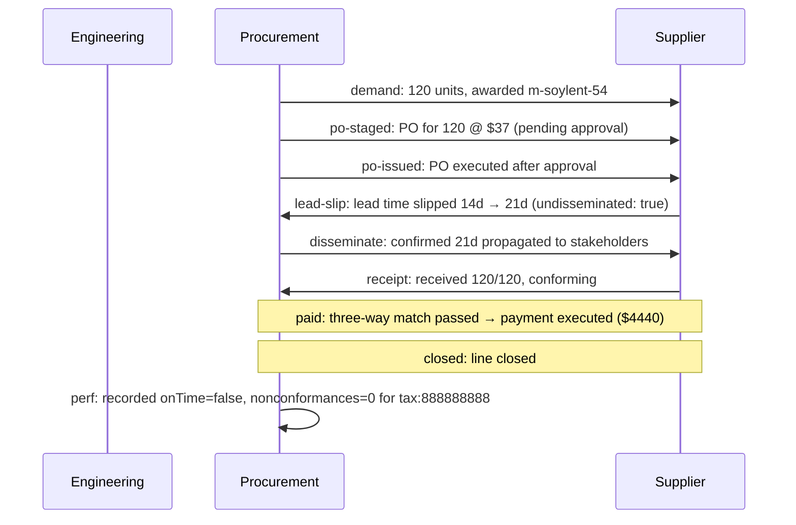

# Procure-to-pay timeline

| slot | supplier | received | lead | quality | payment | final state |
| --- | --- | --- | --- | --- | --- | --- |
| motor | Soylent Drives LLC | 120/120 | 21d (slipped) | ok | paid | closed |
| gearbox | Tyrell Gearworks | 120/120 | 18d | ok | paid | closed |
| encoder | Umbrella Encoders GmbH | 120/120 | 20d | ok | unpaid (flagged) | invoiced |
| controller | Soylent Drives LLC | 120/120 | 16d | NCR | paid | closed |
| housing | Acme Steel Inc | 120/120 | 15d | ok | paid | closed |
| harness | Stark Harnessing Ltd | 115/120 | 12d | shortage | paid | closed |
| fasteners | Wayne Fasteners Corp | 720/720 | 10d | ok | paid | closed |

## Event log

| # | slot | event | detail |
| --- | --- | --- | --- |
| 0 | motor | demand | 120 units, awarded m-soylent-54 |
| 1 | motor | po-staged | PO for 120 @ $37 (pending approval) |
| 2 | motor | po-issued | PO executed after approval |
| 3 | motor | lead-slip | lead time slipped 14d → 21d (undisseminated: true) |
| 4 | motor | disseminate | confirmed 21d propagated to stakeholders |
| 5 | motor | receipt | received 120/120, conforming |
| 6 | motor | paid | three-way match passed → payment executed ($4440) |
| 7 | motor | closed | line closed |
| 8 | motor | perf | recorded onTime=false, nonconformances=0 for tax:888888888 |
| 9 | gearbox | demand | 120 units, awarded g-tyrell-20 |
| 10 | gearbox | po-staged | PO for 120 @ $33 (pending approval) |
| 11 | gearbox | po-issued | PO executed after approval |
| 12 | gearbox | disseminate | confirmed 18d propagated to stakeholders |
| 13 | gearbox | receipt | received 120/120, conforming |
| 14 | gearbox | paid | three-way match passed → payment executed ($3960) |
| 15 | gearbox | closed | line closed |
| 16 | gearbox | perf | recorded onTime=true, nonconformances=0 for tax:999999999 |
| 17 | encoder | demand | 120 units, awarded e-umbrella-1000 |
| 18 | encoder | po-staged | PO for 120 @ $18 (pending approval) |
| 19 | encoder | po-issued | PO executed after approval |
| 20 | encoder | disseminate | confirmed 20d propagated to stakeholders |
| 21 | encoder | receipt | received 120/120, conforming |
| 22 | encoder | match-fail | three-way match failed — invoice flagged, NOT paid (price mismatch: invoice 2210 ≠ 120×18) |
| 23 | encoder | open | line left at 'invoiced' — payment unresolved |
| 24 | encoder | perf | recorded onTime=true, nonconformances=0 for tax:444444444 |
| 25 | controller | demand | 120 units, awarded c-soylent-12 |
| 26 | controller | po-staged | PO for 120 @ $26 (pending approval) |
| 27 | controller | po-issued | PO executed after approval |
| 28 | controller | disseminate | confirmed 16d propagated to stakeholders |
| 29 | controller | ncr | quality nonconformance — exception opened |
| 30 | controller | paid | three-way match passed → payment executed ($3120) |
| 31 | controller | resolve | resolved: nonconformance: quality reject |
| 32 | controller | closed | line closed |
| 33 | controller | perf | recorded onTime=true, nonconformances=1 for tax:888888888 |
| 34 | housing | demand | 120 units, awarded h-acme-65 |
| 35 | housing | po-staged | PO for 120 @ $19 (pending approval) |
| 36 | housing | po-issued | PO executed after approval |
| 37 | housing | disseminate | confirmed 15d propagated to stakeholders |
| 38 | housing | receipt | received 120/120, conforming |
| 39 | housing | paid | three-way match passed → payment executed ($2280) |
| 40 | housing | closed | line closed |
| 41 | housing | perf | recorded onTime=true, nonconformances=0 for tax:111111111 |
| 42 | harness | demand | 120 units, awarded hn-stark-20 |
| 43 | harness | po-staged | PO for 120 @ $8 (pending approval) |
| 44 | harness | po-issued | PO executed after approval |
| 45 | harness | disseminate | confirmed 12d propagated to stakeholders |
| 46 | harness | shortage | received 115/120 — exception opened |
| 47 | harness | paid | three-way match passed → payment executed ($920) |
| 48 | harness | resolve | resolved: shortage: received 115/120 |
| 49 | harness | closed | line closed |
| 50 | harness | perf | recorded onTime=true, nonconformances=0 for tax:555555555 |
| 51 | fasteners | demand | 720 units, awarded f-wayne-a2 |
| 52 | fasteners | po-staged | PO for 720 @ $0.5 (pending approval) |
| 53 | fasteners | po-issued | PO executed after approval |
| 54 | fasteners | disseminate | confirmed 10d propagated to stakeholders |
| 55 | fasteners | receipt | received 720/720, conforming |
| 56 | fasteners | paid | three-way match passed → payment executed ($360) |
| 57 | fasteners | closed | line closed |
| 58 | fasteners | perf | recorded onTime=true, nonconformances=0 for tax:666666666 |

## Motor sequence

