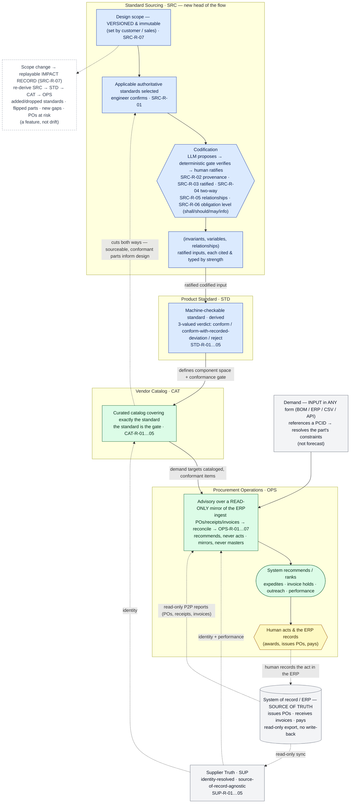

# How work flows — diagram + narrative

The engineering↔procurement flow this doctrine layer encodes, end to end. The
diagram is the map; the narrative walks one job through it. Both track the
constitutions (`SRC → STD → CAT → OPS`, with `SUP` underneath) and the honesty
guardrails: **recommends, never awards**; demand is an **input, not a forecast**;
the ERP is **read-only**; codification is a **human-ratified** frontier.

## The map

## The narrative

**1. It starts with a scope, from the customer — versioned from the first line.**
Sales or a customer defines the *design scope* (e.g. "a washdown food-processing
conveyor drive, high-pressure caustic washdown, ~40 °C continuous"). Scope is a
**versioned, immutable** entity — every revision is recorded with who/when/why and
never overwritten (`SRC-R-07`). Because scope is fluid in this industry, keeping
its history is a first-class feature, not an afterthought.

**2. The scope selects which authoritative standards apply — and an engineer
confirms.** The applicable standards (MIL-STD, IEC, ISO, …) are derived from the
scope; change the scope and the set re-derives. The system proposes; the engineer
confirms (`SRC-R-01`).

**3. The hard part: turning prose into machine-checkable rules — with a human in
the loop.** This is the heart of **SRC**. The system reads a standard's intent and
*proposes* a codification: **invariants** (always-true), **variables** (the design
space), and **relationships** (conditional guards). Every element is **cited to its
source clause** (`SRC-R-02`) and **typed by obligation level** — *shall / should /
may / informative* (`SRC-R-06`) — so what is non-negotiable is enforced as such and
what is merely recommended is surfaced as such. The trust model is fixed: **LLM
proposes → deterministic gate verifies → human ratifies** (`SRC-R-03`). Nothing
binds until the engineer signs off.

**4. The ratified inputs become a machine-checkable standard — with a three-valued
verdict.** **STD** *derives* (never hand-authors) a standard that rules on any
candidate component deterministically. Because elements carry strength, the verdict
is three-valued: **conformant**, **conformant-with-recorded-deviation** (a *should*
was waived by a recorded, ratified justification), or **non-conformant** (a *shall*
is unmet — no waiver possible) (`STD-R-03`). A recommendation can be disregarded
under careful consideration — but only explicitly, justified, and on the record.

**5. Procurement builds a catalog that covers exactly that standard.** **CAT**
curates approved, conformant sources for every required component and nothing
outside the standard; every entry traces both ways. It **cuts both ways** — it also
feeds back so engineers design with parts that are both conformant *and* sourceable
(`CAT-R-01…05`).

**6. Underneath: one trustworthy view of who each supplier is.** **SUP** resolves
every supplier to one canonical identity, source-of-record-agnostic, **read-only**
synced from a daily ERP export — no write-back, no risky integration (`SUP-R-01…05`).

**7. Real demand arrives — in any form, keyed by a PCID, not a forecast.** Demand
comes **in** from the MRP / build plan; the system never forecasts it. Its *form*
is accidental (BOM, ERP export, CSV, API) — what matters is that each line
references a **Part Constraint ID (PCID)**: a stable identifier minted when
engineering selected the part, binding it to its sourcing spec (the standard's
constraints for it, at a scope version). A referenced PCID resolves automatically
to those constraints — and is itself a signal that the part was selected through
this tool, so its constraints are known and honored. A line with no resolvable
PCID is a surfaced exception (`OPS-R-01`).

**8. The system advises over a read-only mirror — it recommends, it never acts.**
**OPS** does **not** run procure-to-pay; the company's existing system of record
does that. Instead OPS **ingests the ERP's reports read-only** (POs issued, goods
received, invoices) and mirrors that state — it never mints, advances, or writes
it back (`OPS-R-02`). Off that mirror it **recommends**: the rank-1 conformant
supplier with a reproducible scorecard, which invoices to hold (three-way-match
mismatches), which suppliers to expedite or chase for an updated delivery date,
what a scope change put at risk. **A human takes the action and the ERP records
it** — awarding, issuing the PO, paying (`OPS-R-03/-R-04`). Supplier performance is
*computed* from the mirror and attached to identity in SUP, feeding the next
recommendation (`OPS-R-07`). Because the tool performs no irreversible act, there
is nothing to stage or gate — reversibility is upheld by abstention.

**9. When anything upstream changes, it ripples — and the impact is recorded.**
A scope change (or a re-ratified rule) flows **SRC → STD → CAT → OPS**, and the
transition writes a **replayable impact record** (`SRC-R-07`): standards
added/dropped, elements changed (with obligation level), catalog entries flipped,
new gaps, and in-flight POs at risk. The demo computes exactly this for one change
(`demo/out/reconcile.md`: 6 newly non-conformant, 1 gap, 2 POs at risk). Because
every state is a deterministic function of `(scope version, ratified inputs)`, any
past state is re-derivable and any two versions diffable — history is *reproducible*,
not merely logged.

**The one-sentence version:** a customer's *versioned* scope picks the standards →
a human ratifies the machine's *cited, strength-typed* codification of them → that
becomes a deterministic, three-valued conformance gate → procurement builds a
catalog that passes it → real demand (keyed by PCID) flows in, and over a
**read-only mirror of the ERP** the system **recommends** while a **human acts and
the ERP records** — and any upstream change ripples cleanly, leaving a replayable
record of exactly what it broke.

> **The boundary, stated plainly:** this tool is advisory. It **recommends, never
> acts; mirrors, never masters; and is never the source of truth.** Issuing POs,
> receiving invoices, and paying live in the company's existing system of record;
> the tool ingests those read-only and helps procurement decide what to do next.
