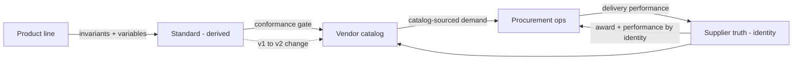
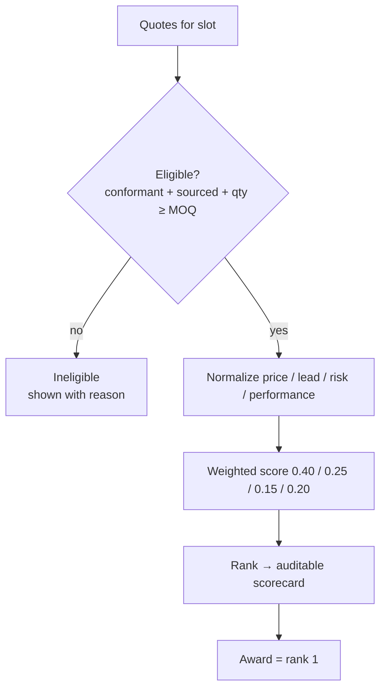
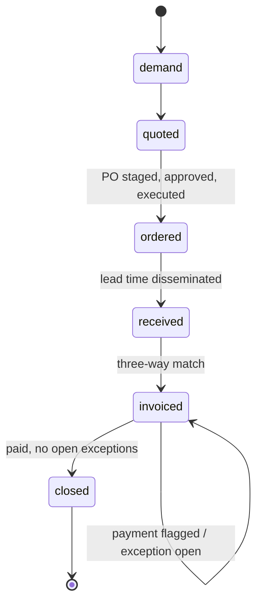
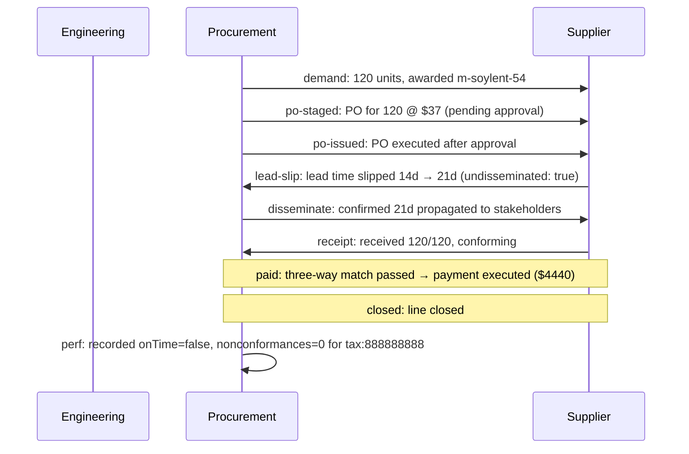

# Cyberdyne GM-Series — engineering→procurement, end to end

A fully synthetic, fully deterministic run of the eng-procurement framework: a
7-slot sealed DC gearmotor, built 120 units over Q3-2026. Everything below is
generated by `npm run demo` from the code — the tables are the program's output.

## 1. The pipeline

## 2. The standard covers its catalog (both directions)

Seven slots, each its own derived standard. Coverage is green: every required slot
has a conformant, sourced source; nothing sits outside the standard.

| slot | status | gaps | non-conforming | unsourced | unjustified-alt |
| --- | --- | --- | --- | --- | --- |
| motor | ✓ covered | 0 | 0 | 0 | 0 |
| gearbox | ✓ covered | 0 | 0 | 0 | 0 |
| encoder | ✓ covered | 0 | 0 | 0 | 0 |
| controller | ✓ covered | 0 | 0 | 0 | 0 |
| housing | ✓ covered | 0 | 0 | 0 | 0 |
| harness | ✓ covered | 0 | 0 | 0 | 0 |
| fasteners | ✓ covered | 0 | 0 | 0 | 0 |

The gate also turns submissions away — one per failure mode:

| submission | rejected by | detected | as expected |
| --- | --- | --- | --- |
| f-cyberdyne-bad | CAT-R-03 (standard is the gate) | nonconforming | ✓ |
| e-ghost | CAT-R-02 (provenance both ways) | unsourced | ✓ |
| x-bluetooth | CAT-R-01 (bounded — nothing outside the standard) | out-of-standard | ✓ |
| m-rogue-24 | CAT-R-04 (alternates equivalence-justified) | unjustified-alternate | ✓ |

## 3. One company, three names → one identity

The supplier master resolves every spelling/feed of a vendor to a single identity,
and an external system-of-record produces the identical partition.

| incoming reference | resolved identity |
| --- | --- |
| Acme Steel Inc / 11-1111111 (ariba) | tax:111111111 |
| ACME STEEL / 111111111 (email) | tax:111111111 |
| Acme Steel Incorporated (manual) | tax:111111111 |
| Globex Plastics LLC / 22-2222222 | tax:222222222 |
| Globex Plastics / 222222222 (edi) | tax:222222222 |
| Initech Controls Co / 33-3333333 | tax:333333333 |
| Umbrella Encoders GmbH / 44-4444444 | tax:444444444 |
| Stark Harnessing Ltd / 55-5555555 | tax:555555555 |
| Wayne Fasteners Corp / 66-6666666 | tax:666666666 |
| Wonka Encoder Works / 77-7777777 | tax:777777777 |
| Soylent Drives LLC / 88-8888888 | tax:888888888 |
| Tyrell Gearworks / 99-9999999 | tax:999999999 |
| Cyberdyne Internal MRO / 10-1010101 | tax:101010101 |
| Hooli Housings Inc / 12-1212121 | tax:121212121 |
| Vandelay Wiring / 13-1313131 | tax:131313131 |

Local master vs external system-of-record induce the **same partition** over these references: **✓ identical** — the consumer contract is store-agnostic (SUP-R-01/-R-05).

## 4. Who wins each PO — and why

**motor** (order 120; weights: price 0.4 · lead 0.25 · risk 0.15 · performance 0.2)

| rank | entry | supplier | price | lead | risk | perf | score | outcome |
| --- | --- | --- | --- | --- | --- | --- | --- | --- |
| 1 | m-soylent-54 | Soylent Drives LLC | $37.00 | 14d | 1.00 | 0.80 | 0.95 | 🏆 AWARD |
| 2 | m-acme-12 | Acme Steel Inc | $39.50 | 21d | 0.67 | 0.90 | 0.67 | eligible |
| 3 | m-acme-24 | Acme Steel Inc | $42.00 | 21d | 0.67 | 0.90 | 0.47 | eligible |
| 4 | m-globex-24 | Globex Plastics LLC | $40.00 | 35d | 0.00 | 0.50 | 0.16 | eligible |

**gearbox** (order 120; weights: price 0.4 · lead 0.25 · risk 0.15 · performance 0.2)

| rank | entry | supplier | price | lead | risk | perf | score | outcome |
| --- | --- | --- | --- | --- | --- | --- | --- | --- |
| 1 | g-tyrell-20 | Tyrell Gearworks | $33.00 | 18d | 1.00 | 0.90 | 0.60 | 🏆 AWARD |
| 2 | g-globex-10 | Globex Plastics LLC | $30.00 | 25d | 0.00 | 0.50 | 0.40 | eligible |

**encoder** (order 120; weights: price 0.4 · lead 0.25 · risk 0.15 · performance 0.2)

| rank | entry | supplier | price | lead | risk | perf | score | outcome |
| --- | --- | --- | --- | --- | --- | --- | --- | --- |
| 1 | e-umbrella-1000 | Umbrella Encoders GmbH | $18.00 | 20d | 0.00 | 0.90 | 0.85 | 🏆 AWARD |
| 2 | e-wonka-1000 | Wonka Encoder Works | $19.00 | 28d | 1.00 | 0.70 | 0.15 | eligible |

**controller** (order 120; weights: price 0.4 · lead 0.25 · risk 0.15 · performance 0.2)

| rank | entry | supplier | price | lead | risk | perf | score | outcome |
| --- | --- | --- | --- | --- | --- | --- | --- | --- |
| 1 | c-soylent-12 | Soylent Drives LLC | $26.00 | 16d | 1.00 | 0.80 | 0.80 | 🏆 AWARD |
| 2 | c-acme-12 | Acme Steel Inc | $29.00 | 22d | 0.00 | 0.90 | 0.20 | eligible |

**housing** (order 120; weights: price 0.4 · lead 0.25 · risk 0.15 · performance 0.2)

| rank | entry | supplier | price | lead | risk | perf | score | outcome |
| --- | --- | --- | --- | --- | --- | --- | --- | --- |
| 1 | h-acme-65 | Acme Steel Inc | $19.00 | 15d | 1.00 | 0.90 | 1.00 | 🏆 AWARD |
| 2 | h-acme-54 | Acme Steel Inc | $22.00 | 18d | 1.00 | 0.90 | 0.45 | eligible |
| 3 | h-hooli-54 | Hooli Housings Inc | $21.00 | 20d | 0.00 | 0.70 | 0.13 | eligible |

**harness** (order 120; weights: price 0.4 · lead 0.25 · risk 0.15 · performance 0.2)

| rank | entry | supplier | price | lead | risk | perf | score | outcome |
| --- | --- | --- | --- | --- | --- | --- | --- | --- |
| 1 | hn-stark-20 | Stark Harnessing Ltd | $8.00 | 12d | 1.00 | 0.80 | 1.00 | 🏆 AWARD |

**fasteners** (order 720; weights: price 0.4 · lead 0.25 · risk 0.15 · performance 0.2)

| rank | entry | supplier | price | lead | risk | perf | score | outcome |
| --- | --- | --- | --- | --- | --- | --- | --- | --- |
| 1 | f-wayne-a2 | Wayne Fasteners Corp | $0.50 | 10d | 0.00 | 1.00 | 0.60 | 🏆 AWARD |
| 2 | f-cyberdyne-a4 | Cyberdyne Internal MRO | $0.70 | 8d | 1.00 | 0.70 | 0.40 | eligible |

Awards: motor → **m-soylent-54** (Soylent Drives LLC); gearbox → **g-tyrell-20** (Tyrell Gearworks); encoder → **e-umbrella-1000** (Umbrella Encoders GmbH); controller → **c-soylent-12** (Soylent Drives LLC); housing → **h-acme-65** (Acme Steel Inc); harness → **hn-stark-20** (Stark Harnessing Ltd); fasteners → **f-wayne-a2** (Wayne Fasteners Corp).

**Closed loop:** with performance history the gearbox award is
**g-tyrell-20**, but ignoring performance it would be
**g-globex-10** — recorded delivery behavior changes the decision.

## 5. The quarter runs

| slot | supplier | received | lead | quality | payment | final state |
| --- | --- | --- | --- | --- | --- | --- |
| motor | Soylent Drives LLC | 120/120 | 21d (slipped) | ok | paid | closed |
| gearbox | Tyrell Gearworks | 120/120 | 18d | ok | paid | closed |
| encoder | Umbrella Encoders GmbH | 120/120 | 20d | ok | unpaid (flagged) | invoiced |
| controller | Soylent Drives LLC | 120/120 | 16d | NCR | paid | closed |
| housing | Acme Steel Inc | 120/120 | 15d | ok | paid | closed |
| harness | Stark Harnessing Ltd | 115/120 | 12d | shortage | paid | closed |
| fasteners | Wayne Fasteners Corp | 720/720 | 10d | ok | paid | closed |

Motor lifecycle in detail:

## 6. Engineering changes the standard — watch what breaks

Two edits: raise the ingress floor (ip54 → ip65) on motor + housing, and drop 12V
on motor + controller. The system names **exactly** what to re-source and which
in-flight POs are now at risk.

**Newly non-conformant catalog entries (6):**

| slot | entry |
| --- | --- |
| motor | m-acme-12 |
| motor | m-soylent-54 |
| controller | c-soylent-12 |
| controller | c-acme-12 |
| housing | h-acme-54 |
| housing | h-hooli-54 |

**New sourcing gaps (1):** controller

**In-flight POs at risk (2):**

| slot | awarded entry | supplier |
| --- | --- | --- |
| motor | m-soylent-54 | Soylent Drives LLC |
| controller | c-soylent-12 | Soylent Drives LLC |

**Automatic re-award of affected slots:**

| slot | outcome |
| --- | --- |
| motor | re-awarded to m-acme-24 (Acme Steel Inc) |
| controller | GAP — no eligible supplier, re-source required |
| housing | re-awarded to h-acme-65 (Acme Steel Inc) |

**Headline:** 6 entries newly non-conformant, 1 new
sourcing gap, 2 POs at risk — computed, not estimated.
